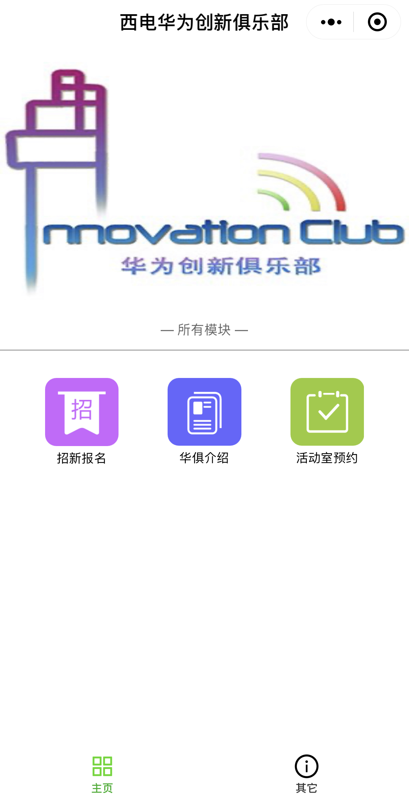
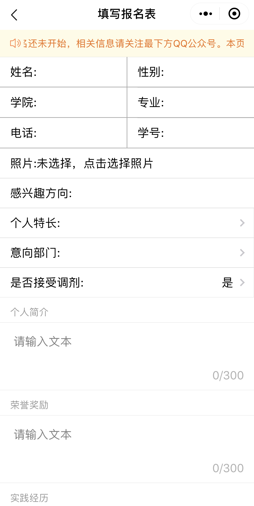
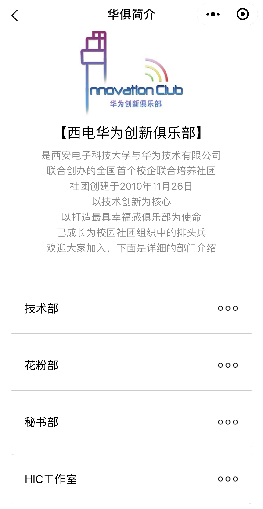
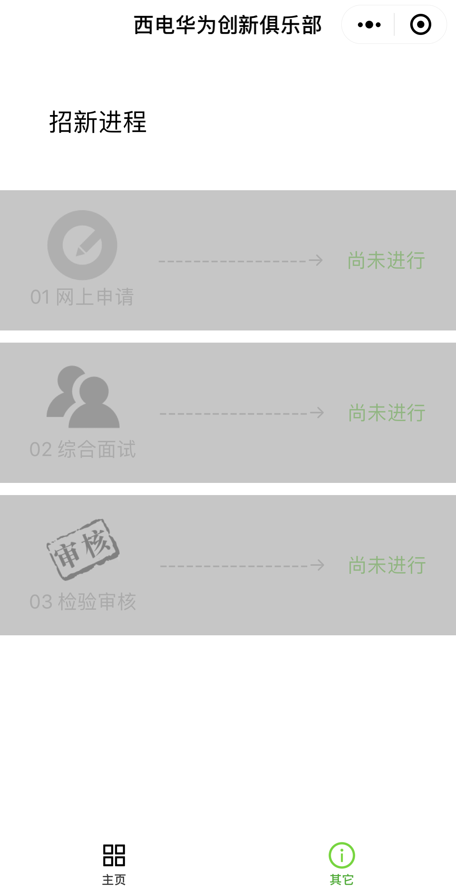

# 西安电子科技大学华为创新俱乐部本科生部官方微信小程序：西电小小为

## 简介

+ 项目采用云开发，不使用配套后台服务器，无需服务器运维。

## 功能

1.新生报名

2.俱乐部简介

3.查看报名信息

4.查看面试流程

## 职能

+ 承担2019级本科新生的招新报名工作

## 已知BUG：

```
未报名成功时，在报名页面上传照片会上传到服务器，但是对用户体验不存在影响，仅仅会多占用数据库容量。
建议：不改也行。
```

## 下一步改进：

+ 报名页退出时新增存为草稿机制

## 使用

+ 将代码clone至本地，在微信开发者工具中导入此项目并勾选云开发。
+ 将`project.config.json`中的`appid`改为自己的appid。
+ 将`app.js`中的`env`改为自己的环境名称。
+ 将`Check.js`中的`fileID`前缀改为自己的路径。
+ 在云开发数据库新增两个集合：`About`和`Recruit`，`Recruit`为空集合，`About`集合字段见附录1。

## 截图









## 注意

+ **2020级新生报名不再使用此小程序，最新信息请关注官方消息。**

## 附录1:数据库About集合字段

```json
{"_id":"6c791e14-8428-4d3b-a2df-68c7d2e594b2","apply":"0","interview":"0","check":"0","noticeTextAtCheck":"你已成功报名，请耐心等待短信通知。下面是你所提交的报名信息。如需修改请在招新群6992XXXX联系管理员。","noticeTextAtEmployWhenApplyIs0":"报名还未开始，相关信息请关注最下方QQ公众号。本页面只用于本科生报名，研究生报名请访问小程序“西电华小为”。","noticeTextAtEmployWhenApplyIs1":"报名正在进行，快填写信息加入华创家庭吧！本页面只用于本科生报名，研究生报名请访问小程序“西电华小为”。","noticeTextAtEmployWhenApplyIs2":"报名通道已经关闭。本页面只用于本科生报名，研究生报名请访问小程序“西电华小为”。"}
```

